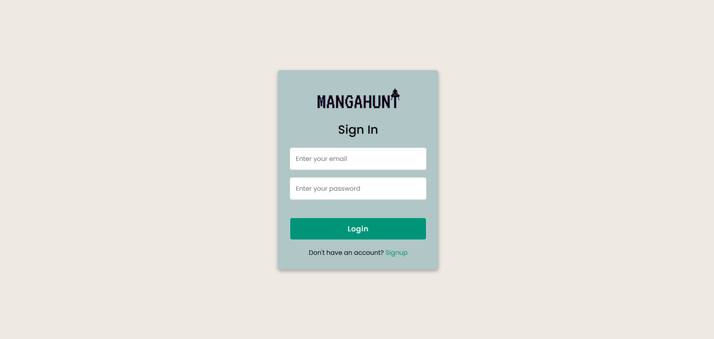
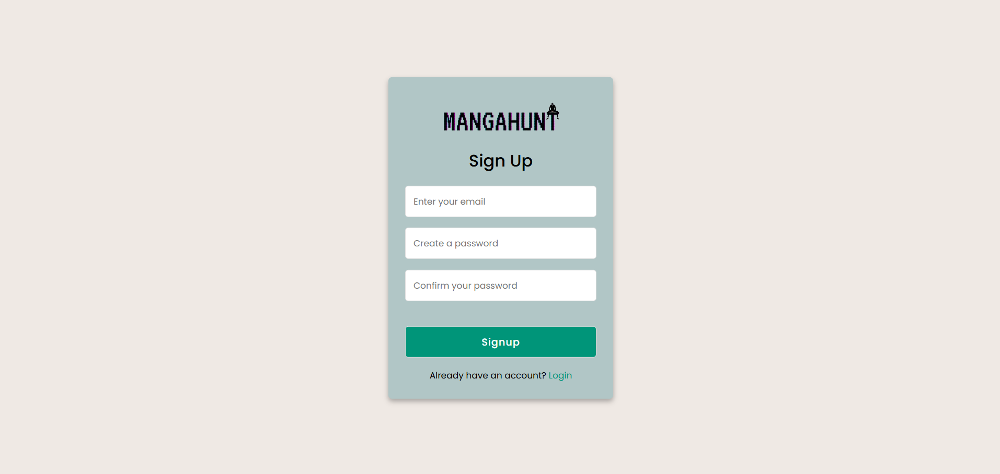
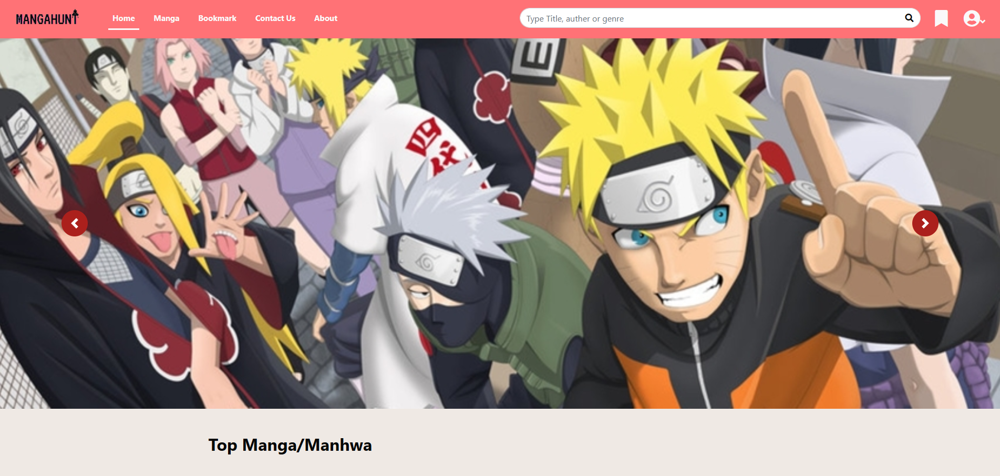
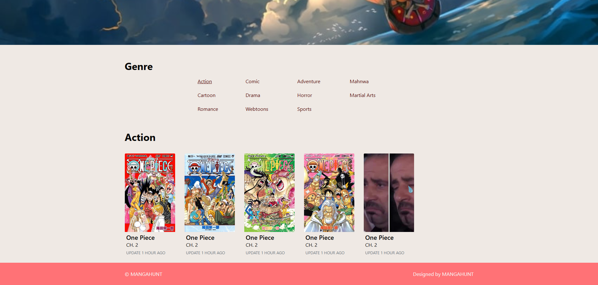
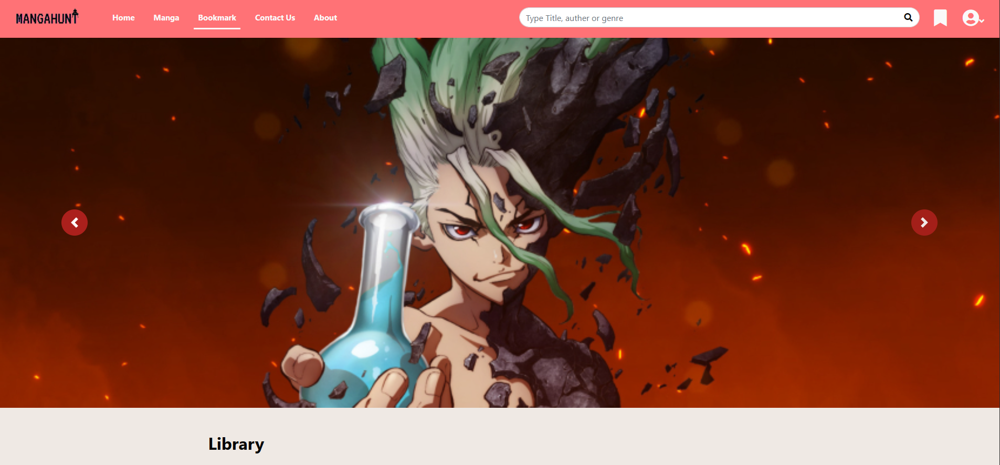
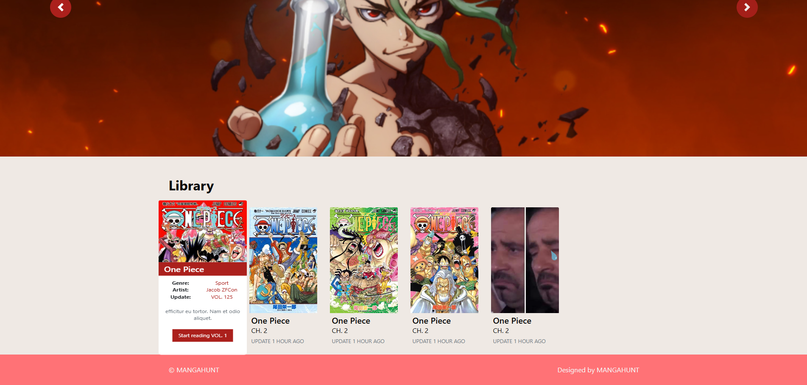
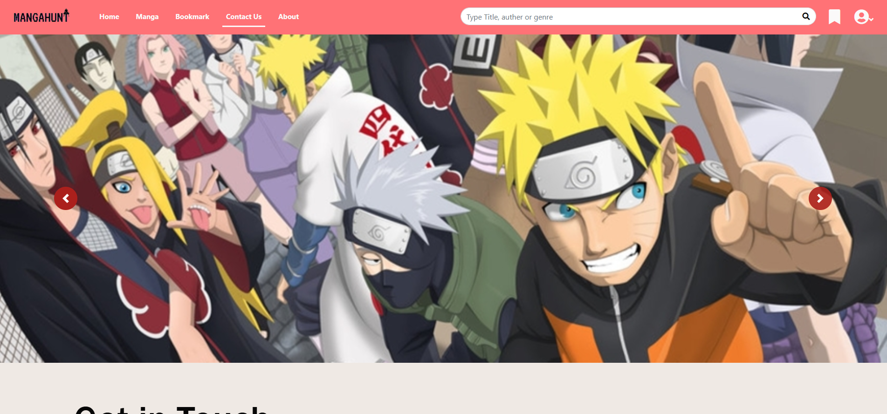
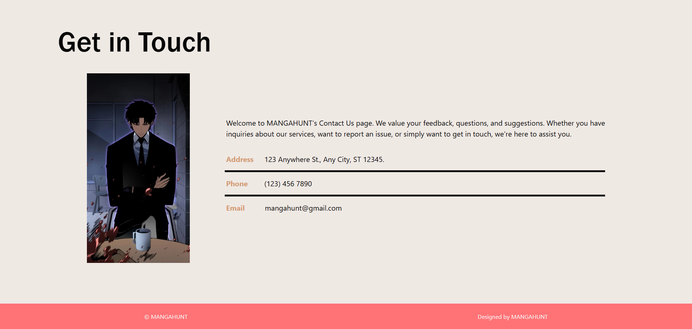
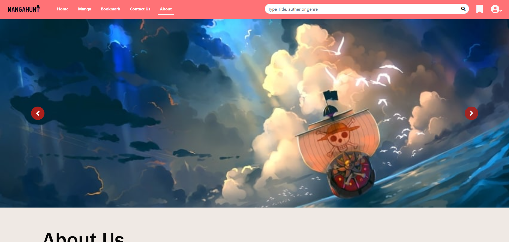
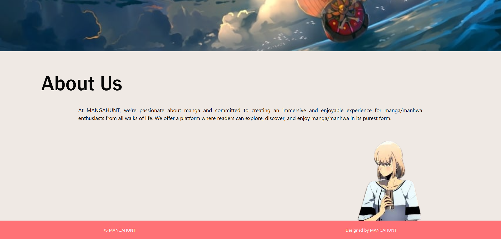

# MangaHunt

## 📖 What is this?

**MangaHunt** is a responsive web template for a manga website where users can browse, read, and stay updated with the latest manga. The project includes sections like the homepage, manga listings, bookmarks, contact form, and about page.

---

## 💡 Project Details

This project uses modern web technologies and libraries:

- **HTML5**
- **CSS3**
- **Bootstrap 4**
- **jQuery**
- **PDF.js** – for rendering manga pages
- **MongoDB** – used for storing manga data, bookmarks, and user information

---

## 🖼 Mockups

Below are sample mockup screenshots found in `img\mockup\`:

### Authentication Pages
- 
- 

### Homepage
- 
- 

### Manga Page
- 
- 

### Bookmark Page
- 
- 

### Contact Page
- 
- 

### About Page
- 
- 

---

## 🚀 Features

- User-friendly UI for manga reading and exploration
- Bookmark system
- Responsive design
- Contact form integration
- Backend data handling via MongoDB